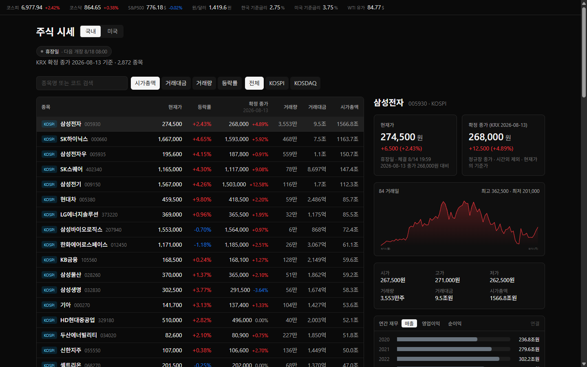
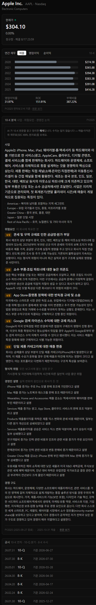
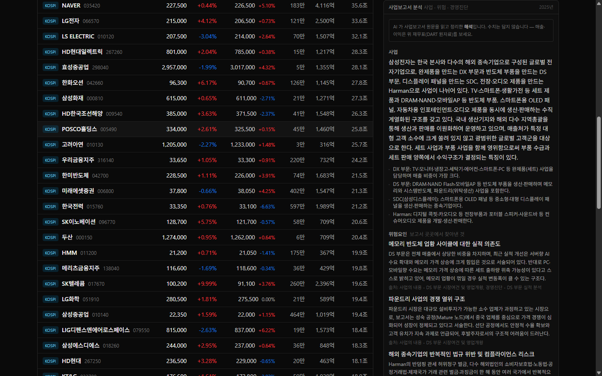
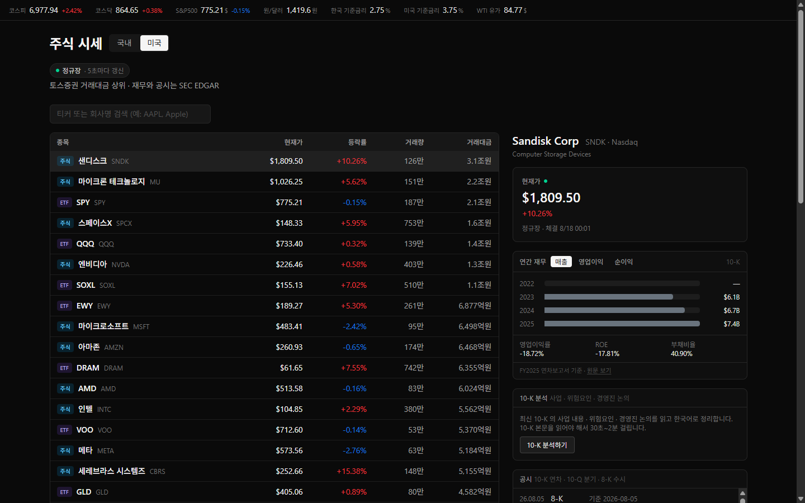

# 증권 정보 대시보드

국내(KRX)와 미국 주식의 **시세 · 공시 · 재무 · 기업분석**을 한 화면에서 보는 읽기 전용 대시보드.

공시 원문(10-K · 사업보고서)을 LLM 이 읽고 한국어로 정리해 주는 것이 이 프로젝트의 중심 기능이다.
**재무 수치는 LLM 이 만들지 않는다** — XBRL 원자료에서 직접 계산하고, LLM 은 문장 해석만 한다.

🔗 **[http://129.225.188.89](http://129.225.188.89)** — 상시 구동 중 (접근 비밀번호가 걸려 있다. 필요하면 알려 주세요)



---

## 무엇을 하는가

| | 국내 (KRX) | 미국 |
| --- | --- | --- |
| 현재가 | 토스증권 · 5초 폴링 | 토스증권 · 5초 폴링 |
| 확정 종가 | 공공데이터포털(KRX 공식) | — |
| 일봉 차트 | 84 거래일 | — |
| 연간 재무 | OpenDART XBRL · 6개년 | SEC XBRL · 6개년 |
| 공시 목록 | OpenDART · 유형 필터 | SEC EDGAR · 주요 서식 |
| **서술 분석** | **사업보고서** (Claude) | **10-K** (Claude) |
| 매크로 스트립 | 코스피 · 코스닥 · S&P500 · 원/달러 · 한·미 기준금리 · WTI | |

수집해 둔 데이터: KRX 일별 시세 **24만 행**(84 거래일), DART 상장사 매핑 **3,981건**,
SEC 티커→CIK 매핑 **10,387건**.

---

## 공시 서술 분석

버튼을 누르면 최신 공시 원문을 받아 사업 내용 · 위험요인 · 경영진 논의를 한국어로 정리한다.
한 번 분석한 문서는 저장돼 다음부터는 즉시 뜨고 비용이 들지 않는다.

<table>
<tr><td width="50%"><b>미국 — 10-K</b></td><td width="50%"><b>국내 — 사업보고서</b></td></tr>
<tr><td></td><td></td></tr>
</table>

### 설계에서 신경 쓴 것

**수치를 LLM 에게 맡기지 않는다.** 응답 스키마(Pydantic)에 숫자 필드를 아예 두지 않아
모델이 수치를 끼워 넣을 자리가 없다. 프롬프트에서도 금지하고("매출이 늘었다"는 되고
"매출이 12% 늘었다"는 안 된다), 화면 상단에 *"수치는 담지 않습니다 — 매출·이익은 위 재무표를
보세요"* 를 고정으로 붙여 경계를 밝힌다. 매출·이익·마진·ROE 는 XBRL 계정에서 직접 계산한다.

**형식적 위험과 실질적 위험을 가른다.** 10-K 위험요인의 상당수는 모든 회사에 똑같이 붙는
정형 문구다("자연재해가 발생할 수 있습니다"). 그것을 걸러내 표시한다.

**국내에는 위험요인 항목이 아예 없다.** 10-K 의 Item 1A 에 해당하는 절이 국내 법정 서식에
없다. 위험은 「위험관리 및 파생거래」와 「투자자 보호를 위하여 필요한 사항」(소송·제재·우발부채)에
흩어져 있어서, 그것들을 함께 보내 찾아내게 하고 **각 위험이 보고서 어디에서 나왔는지 출처를
함께 표시**한다. 삼성전자에서 중대재해, 해외 종속기업의 반복 제재, 미국 반도체 보조금 지급보증
같은 것들이 이렇게 잡혔다 — 원문을 끝까지 읽지 않으면 놓치는 항목이다.

**비용 상한을 다섯 겹으로 둔다.** 개인 프로젝트의 비용 사고는 대개 모델이 비싸서가 아니라
같은 호출이 반복돼서 난다.

| | |
| --- | --- |
| 1. DB 캐시 | `(접수번호, 모델, 프롬프트 버전)`이 같으면 절대 재호출하지 않는다 |
| 2. 하루 상한 | 기본 20건. **국내·미국 합산** — 상한은 지갑 기준이지 시장 기준이 아니다 |
| 3. 동시 1건 | 잠금 획득 후 캐시를 다시 확인해 경합 시 중복 호출을 막는다 |
| 4. 입력 상한 | 호출 **전에** `count_tokens`(무료)로 재고, 넘으면 잘라서 다시 잰다 |
| 5. 실패 기록 | 실패도 저장해 화면을 열 때마다 재시도하는 일을 막는다 |

읽기(`GET`)와 실행(`POST`)을 HTTP 메서드로 갈라 두어, **화면을 여는 것만으로 과금되는 사고가
구조적으로 불가능**하다. 문서 1건 실측 비용은 미국 190~290원, 국내 320~340원.

---

## 실제 문서를 만나며 고친 것들

여기가 이 프로젝트에서 가장 시간을 먹은 부분이다. 공시 원문은 스펙 문서만 읽고는 다룰 수 없다.

**10-K 는 회사마다 형식이 다르다.** 실제 문서 10건을 돌려 가며 함정 세 개를 찾았다.

- 본문 속 상호참조가 진짜 제목을 이긴다. *"as described in Item 1A"* 가 본문 제목보다 앞서
  나와 구간이 더 길게 잡혔다 → 제목은 줄 맨 앞이어야 하고 번호 뒤에 제목 단어가 와야 인정한다.
- **표를 버리면 제목이 사라진다.** 수치 표는 XBRL 로 이미 갖고 있어 통째로 버렸더니, 항목 제목을
  표로 레이아웃하는 월마트에서 세 항목을 하나도 못 찾았다 → 표를 숫자 비율로 판별해 수치 표만 버린다.
- **MD&A 를 쪽 참조로만 적는 문서가 있다.** JPMorgan 은 *"Item 7 … 46–160쪽 참조"* 한 줄뿐이고
  본문은 같은 파일 다른 자리에 있다 → Item 7 이 비면 MD&A 자체 제목으로 다시 찾는다. 그 제목이
  목차와 페이지 머리글로 42번 반복돼서, 숫자 비율이 아니라 *"뒤에 긴 문단이 오는가"* 로 본문을 가려낸다.

**DART 는 법정 서식이라 오히려 쉬웠다.** `<SECTION-1>` 로 목차가 계층 구조로 들어 있어 8종목 중
7종목이 첫 시도에 통과했다. 걸린 곳은 KB금융 하나인데 함정이 둘 겹쳐 있었다 — 보고서 이름이
`[기재정정]사업보고서` 라 `startswith` 로는 놓치고, **그 정정본은 원문 파일이 아예 없다**(`status 014`).
후보를 최신순 3건까지 순서대로 시도해 해결했다.

**모델의 effort 를 낮추면 조용히 망가진다.** latency 를 아끼려 `effort: medium` 으로 뒀더니
MSFT 에서 다섯 필드 중 첫 필드만 채우고 끝냈다(출력 430토큰, 정상은 2,600). 입력은 멀쩡했다 —
추출기로 확인하니 Item 1A 가 정확한 위치에서 시작했다. `high` 로 올려 해결하고, 껍데기 응답을
캐시가 영구히 돌려주지 않도록 **완결성 검사**를 넣었다.

**등락률은 직접 계산해야 한다.** 토스 시장지표 응답에는 기준가도 등락률도 없고 `timestamp` 도
항상 `null` 이다. 캔들의 전일 종가로 계산하고, 없는 기준 시각은 지어내지 않고 빈 값으로 둔다.

**미국 종목 현재가에도 기준가가 없다**(랭킹 응답에만 있다). SPY 가 거래대금 상위 100에 늘 있으리라
기대하는 대신 국내 지수와 같은 방식(캔들)으로 통일했다. 캔들의 전일 종가가 랭킹의 `basePrice` 와
정확히 일치하는 것을 확인했다.

---

## 매크로 스트립



**새 키를 거의 늘리지 않았다.** 기획 단계에서는 ECOS·FRED 를 직접 부르려 했지만, 조사해 보니
대부분 이미 있는 것으로 됐다.

| 지표 | 출처 | 갱신 |
| --- | --- | --- |
| 코스피 · 코스닥 · 원/달러 | 토스증권 | 장중 실시간 |
| S&P500 | 토스증권 (SPY) | 미국장 중 실시간 |
| 한국 · 미국 기준금리 | **별도 운영 중인 매크로 프로젝트의 공개 결과물** | 하루 1회 |
| WTI 유가 | FRED | 하루 1회 |

기준금리는 같은 사람이 별도로 운영하는 [매크로 대시보드](https://greyx9-sketch.github.io/macro/)가
이미 ECOS·FRED 에서 수집해 공개하는 JSON 을 읽는다. 같은 수집을 두 번 하지 않는 것보다,
**두 화면의 숫자가 어긋날 일이 없어지는 것**이 더 큰 이득이다.

밝혀 둔 것 둘 — **S&P500 은 지수가 아니라 추종 ETF(SPY) 가격이다**(토스에 미국 지수가 없다.
등락률은 사실상 같지만 값이 지수가 아니므로 툴팁에 명시). **국고채 3년은 뺐다**(토스 지표 심볼
20가지가 전부 거절되고 카탈로그가 비공개다. 매일 보는 값으로는 정책금리가 낫다고 판단).

한 곳이 죽어도 나머지는 보여준다. 마지막 성공값을 DB 에 남겨 두고, 못 받으면 "갱신지연" 표시와
함께 그것을 보여준다 — 오래된 값을 최신처럼 보여주는 것이 값이 없는 것보다 나쁘다.

---

## 기술 스택

| | |
| --- | --- |
| 백엔드 | Python 3.12 · FastAPI · SQLAlchemy · APScheduler · httpx |
| DB | SQLite (WAL) |
| 프론트엔드 | React 19 · TypeScript · Vite · TailwindCSS |
| LLM | Anthropic Claude Sonnet 5 (구조화 출력 · adaptive thinking) |
| 배포 | Oracle Cloud 무료 티어 · Caddy(reverse proxy · basic auth) · systemd |

규모: 백엔드 파이썬 약 8,000줄 / 프론트엔드 TS·TSX 약 2,900줄.

### 외부 데이터 소스

| 소스 | 용도 | 주의점 |
| --- | --- | --- |
| 토스증권 Open API | 국내·미국 시세, 종목정보, 환율, 장 운영시간, 랭킹, 지수 | REST 만 제공(WebSocket 없음) → 서버 폴링. **허용 IP 등록 필수** |
| OpenDART | 국내 공시·재무·사업보고서 원문 | 오류도 HTTP 200 으로 온다 — 본문 `status` 를 봐야 한다 |
| SEC EDGAR | 미국 공시·재무·10-K 원문 | User-Agent 에 이름·이메일 없으면 403. 초당 10건 상한 |
| 공공데이터포털 | KRX 공식 확정 종가 | 다음 영업일 13시 이후 공개 |
| FRED | WTI 유가 | 값 없는 날은 `"."` 로 온다 |
| Anthropic | 공시 서술 분석 | 유일하게 돈이 나가는 경로 |

---

## 아키텍처

```
                         ┌─────────────────────────────────────────┐
   브라우저 ──────────────▶│  FastAPI (uvicorn, 워커 1개)             │
   (React SPA)            │                                         │
                          │  ┌───────────────────────────────────┐  │
                          │  │ 시세 폴러 (백그라운드)              │  │
                          │  │  장 운영시간 API 로 세션 판단        │──┼──▶ 토스증권
                          │  │  정규장 5초 / 시간외 15초 / 마감 0   │  │
                          │  └───────────────────────────────────┘  │
                          │  ┌───────────────────────────────────┐  │
                          │  │ 스케줄러 (APScheduler)             │  │
                          │  │  평일 13:20 KRX 확정 종가 적재      │──┼──▶ 공공데이터포털
                          │  └───────────────────────────────────┘  │
                          │  ┌───────────────────────────────────┐  │
                          │  │ 요청 시 조회                       │──┼──▶ OpenDART / SEC
                          │  │  공시 · 재무 · 서술 분석            │──┼──▶ Anthropic
                          │  └───────────────────────────────────┘  │
                          └──────────────────┬──────────────────────┘
                                             ▼
                                      SQLite (data/app.db)
```

**설계 결정 몇 가지**

- **uvicorn 워커는 반드시 1개.** 토스 액세스 토큰이 `client_id` 당 하나만 유효해서, 프로세스가
  여럿이면 서로의 토큰을 무효화한다. 폴러·스케줄러도 하나만 돌아야 한다.
- **외부 API 는 백엔드에서만 부른다.** 토스는 허용 IP 방식이라 브라우저에서 애초에 막히고,
  시크릿이 노출된다.
- **토스를 부르는 곳은 폴러 한 군데뿐.** 화면 조회는 캐시만 읽어 항상 즉시 응답한다.
- **API 그룹별 토큰 버킷.** 토스는 그룹마다 rate limit 이 다르고(초당 3~10회), SEC 는 초당 10건이다.
- **브라우저 저장소를 쓰지 않는다.** 상태는 서버 DB 또는 React 상태에만 둔다.
- 배포하면 **백엔드 하나가 화면까지 내보낸다.** 프로세스가 하나면 서버 관리가 단순해지고,
  화면과 API 가 같은 주소에서 나오니 CORS 도 필요 없다.

---

## 직접 돌려보기

```bash
git clone https://github.com/greyx9-sketch/stock-dashboard.git
cd stock-dashboard

# 1) 키 설정 — .env.example 을 복사해 채운다. 어디서 발급받는지 주석에 적혀 있다.
cp .env.example .env

# 2) 백엔드
python -m venv .venv
.venv/Scripts/activate          # Windows / macOS·Linux 는 source .venv/bin/activate
pip install -r backend/requirements.txt

# 3) 프론트엔드
cd frontend && npm install && npm run build && cd ..

# 4) 실행 — http://127.0.0.1:8000
cd backend && python -m uvicorn app.main:app --port 8000
```

키 없이도 서버는 뜬다. 각 기능은 필요한 시점에 키를 확인하고, 없으면 *어디서 발급받아 어디에
넣어야 하는지* 알려주며 멈춘다. 최소한 토스증권 키(시세)와 `SEC_USER_AGENT`(미국 재무)가 있으면
대부분이 동작한다.

API 문서는 실행 후 `/docs` 에 있다.

### 테스트

```bash
pip install -r backend/requirements-dev.txt
pytest backend/tests
```

**네트워크를 부르지 않고 API 키도 필요 없다.** 전부 순수 함수 대상이라 1초 안에 끝난다.
대상은 실제로 버그가 났던 곳들이다 — 공시 원문 추출기(10-K · 사업보고서), 등락률 계산,
비용 계산, 매크로 단위 변환. 아래 "실제 문서를 만나며 고친 것들" 의 실패 사례가 그대로
회귀 테스트로 들어가 있다.

실제 문서를 받아 눈으로 확인하는 점검 스크립트도 따로 있다(외부 API 호출):

```bash
python backend/scripts/check_tenk.py AAPL JPM WMT   # 10-K 섹션 추출 (LLM 호출 없음)
python backend/scripts/check_report.py 005930       # 사업보고서 절 추출 (LLM 호출 없음)
python backend/scripts/check_krx.py                 # KRX 확정 종가 ↔ 토스 기준가 대조
```

---

## 아직 안 한 것

정직하게 적어 둔다.

- 테스트가 순수 함수(추출기·계산)만 덮는다. 라우터·서비스 계층의 통합 테스트가 없다.
- 수급 동향(투자자별 매매동향 · 공매도 · 프로그램매매 · 신용거래 · 대차거래)은 토스 API 가
  제공하는데 아직 화면에 없다.
- 관심종목 · 종목 메모 · 일정(실적·배당) 기능이 없다.
- 국내 재무는 사업보고서(연간)만 다룬다. 분기·반기는 누적/당분기 구분이 섞여 별도 처리가 필요하다.
- 미국은 10-K 제출사만 다룬다. 20-F 를 내는 외국 발행사는 재무·분석이 비어 있다.
- 도메인이 없어 HTTPS 가 아니다. 접근 비밀번호가 암호화 없이 오간다.

---

## 만든 사람

금융권 실무자가 Claude Code 와 함께 만들었다. 코딩 경험 없이 시작해, 기획서를 쓰고 요구사항을
잘게 쪼개 한 번에 하나씩 동작을 확인하며 붙여 나갔다. 커밋 메시지에 **왜 그렇게 했는지와 무엇에
걸렸는지**를 남겨 두었다 — 위 "실제 문서를 만나며 고친 것들" 은 대부분 그 기록에서 나왔다.
